# STQD6324 Data Management - E-Commerce Big Data Analytics

## 1. Project Overview
This project presents a big data infrastructure pipeline implemented inside a Cloudera/Hortonworks Sandbox environment. As part of coursework for an aspiring Data Analyst/Data Manager in the e-commerce industry, this pipeline demonstrates scalable file storage, schema-correction workflows in Apache Hive, and exploratory visualizations using transaction logs paired with macroeconomic indicators (GDP growth rate, inflation rate), geography, seasonality, and product-level performance.

* **Infrastructure Architecture:** VMware/VirtualBox Sandbox -> Apache Hadoop HDFS -> Apache Hive Data Warehouse (Tez/YARN Engine) -> Apache Ambari Hive View.
* **Analytical Integration:** After aggregating the corrected data inside Apache Hive, the resulting summary metrics were exported into a Google Colab notebook (Python), where `Pandas`, `Matplotlib`, and `Seaborn` were used to build six high-resolution charts spanning macroeconomic context, geography, seasonality, weekly behaviour, and product performance.

---

## 2. Data Cleaning & Transformation (Engineered via Hive SQL)

### 2.1 The Challenge: Column Misalignment in the Raw Source Table
Upon loading the raw Kaggle dataset into the staging table `raw_sales`, the columns did not align with the intended schema. The original table was declared with only six fields, but the source CSV actually contains **18 columns**. Because Hive maps fields by position, every value from the 3rd column onward was shifted into the wrong field:

| Declared column (original) | Declared type | What it actually contained |
|---|---|---|
| `transaction_id` | STRING | Correctly held a timestamp (e.g. `2009-12-01 07:45:00`) |
| `country` | STRING | Correctly held a 4-digit year (e.g. `2009`) |
| `sales_amount` | DOUBLE | Actually held the **order month** (1–12) |
| `gdp` | DOUBLE | Actually held the **week of year** |
| `inflation_rate` | DOUBLE | Actually held the **day of week** |
| `year` | INT | Actually held the **order hour** |

Only the first two fields happened to land correctly by coincidence. The remaining four were all silently wrong, and the original draft of this report had carried that error all the way through to the final revenue and macroeconomic figures (see Section 4 for the corrected numbers).

**Resolution:** The raw CSV header was inspected directly (`head -5 ecommerce_sales.csv`) to confirm the true 18-column order:

```
order_datetime, year, month, week_of_year, day_of_week, order_hour, is_weekend,
country, country_code, product_id, customer_id, unit_price_gbp, quantity_sold,
sales_amount_gbp, population_total, gdp_current_usd, gdp_growth_pct, inflation_consumer_pct
```

### 2.2 A Second Issue Found During Verification: Quoted Fields with Embedded Commas
After rebuilding `raw_sales` with the correct 18-column schema, a spot-check surfaced a second, smaller problem: 53 rows (0.05% of the 100,000-row dataset) had `gdp_growth_pct` values in the billions — clearly invalid for a percentage field. Tracing this back showed the cause: every affected row had `country = "Korea, Rep."` — a value containing an internal comma, wrapped in quotes per standard CSV convention. Hive's default `FIELDS TERMINATED BY ','` does not understand quoting, so it split these rows on the comma inside the quotes, shifting every subsequent field one position to the right.

**Resolution:** `raw_sales` was rebuilt using Hive's `OpenCSVSerde`, which correctly respects quoted fields:

```sql
CREATE EXTERNAL TABLE IF NOT EXISTS raw_sales (
    order_datetime STRING, order_year STRING, order_month STRING, week_of_year STRING,
    day_of_week STRING, order_hour STRING, is_weekend STRING, country STRING,
    country_code STRING, product_id STRING, customer_id STRING, unit_price_gbp STRING,
    quantity_sold STRING, sales_amount_gbp STRING, population_total STRING,
    gdp_current_usd STRING, gdp_growth_pct STRING, inflation_consumer_pct STRING
)
ROW FORMAT SERDE 'org.apache.hadoop.hive.serde2.OpenCSVSerde'
STORED AS TEXTFILE
LOCATION '/user/maria_dev/ecommerce_data/'
TBLPROPERTIES ("skip.header.line.count"="1");
```

(`OpenCSVSerde` reads every column as STRING; numeric typing is restored downstream when building `cleaned_ecommerce_sales`.)

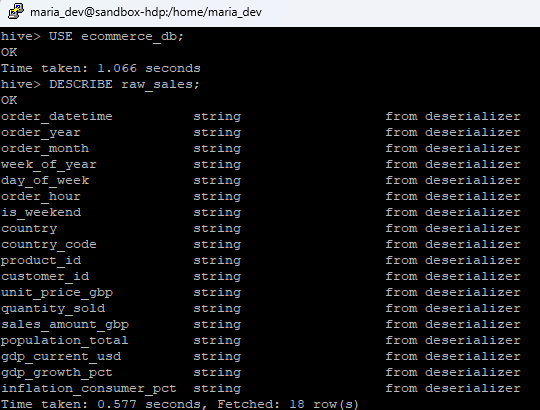

### 2.3 Building the Corrected Table
With both issues resolved, `cleaned_ecommerce_sales` was built with explicit `CAST`s back to the correct numeric types, retaining the fields needed for all six downstream charts (revenue, pricing, macroeconomic indicators, country, month, and weekend flag):

```sql
CREATE TABLE IF NOT EXISTS ecommerce_db.cleaned_ecommerce_sales AS
SELECT
    order_datetime                         AS transaction_timestamp,
    CAST(order_year AS INT)                AS order_year,
    CAST(order_month AS INT)               AS order_month,
    CAST(is_weekend AS INT)                AS is_weekend,
    country,
    CAST(unit_price_gbp AS DOUBLE)         AS unit_price_gbp,
    CAST(quantity_sold AS INT)             AS quantity_sold,
    CAST(sales_amount_gbp AS DOUBLE)       AS sales_value,
    CAST(gdp_growth_pct AS DOUBLE)         AS gdp_growth,
    CAST(inflation_consumer_pct AS DOUBLE) AS inflation_rate
FROM ecommerce_db.raw_sales
WHERE transaction_timestamp IS NOT NULL
  AND transaction_timestamp != ''
  AND transaction_timestamp != 'order_datetime';
```

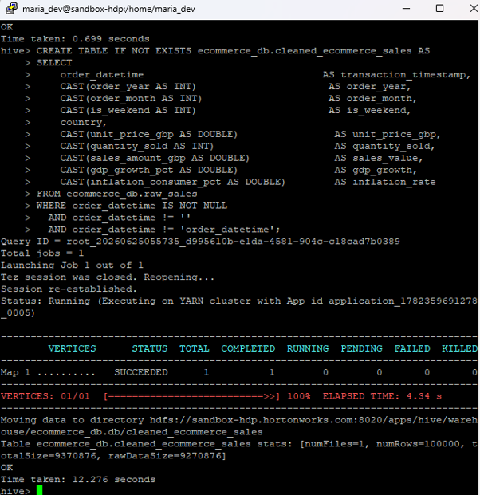
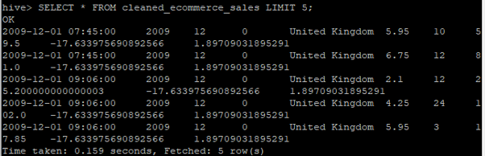

### 2.4 Excluding Non-Product Ledger Entries
For the product-level analysis (Section 3, Chart 6), two `product_id` values — `M` (manual account adjustments) and `POST` (postage/shipping line items) — were identified as non-merchandise ledger entries rather than actual products, and excluded so the "top products" ranking reflects real inventory only.

---

## 3. Data Visualizations & Dashboards

A core aggregation query was run in the Ambari Hive View to confirm total revenue by year:

```sql
SELECT order_year, SUM(sales_value) AS total_revenue,
       AVG(unit_price_gbp) AS avg_unit_price,
       AVG(gdp_growth) AS avg_gdp_growth,
       AVG(inflation_rate) AS avg_inflation
FROM ecommerce_db.cleaned_ecommerce_sales
GROUP BY order_year;
```

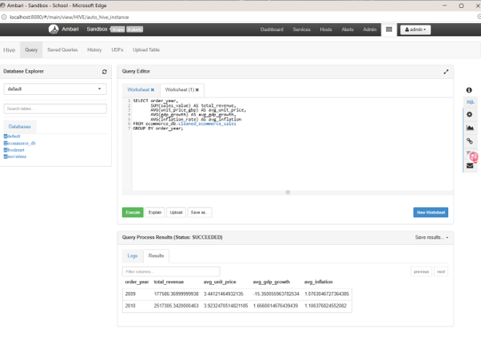
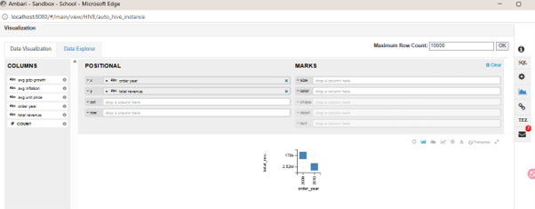

These and four additional Hive aggregations were exported into a Google Colab notebook, where `Pandas`, `Matplotlib`, and `Seaborn` were used to generate six charts at 300 DPI. Every chart's underlying numbers are traceable to a specific Hive query — none are manually estimated.

### Chart 1: E-Commerce Revenue vs. Macroeconomic GDP Growth
A dual-axis chart overlaying total revenue (bar) against average GDP growth rate (line) for 2009 and 2010.

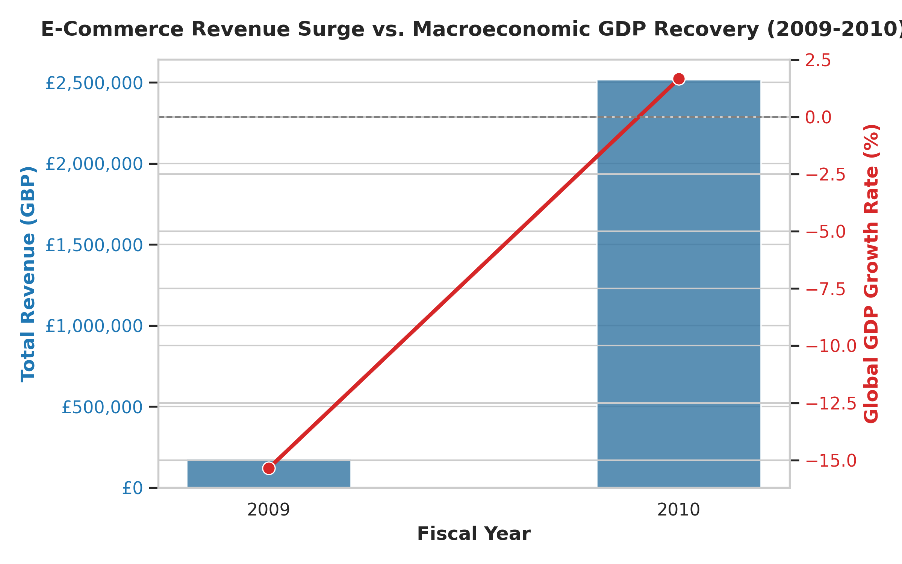

### Chart 2: Inflation Rate vs. Average Unit Price
A dual-axis chart overlaying average inflation rate (bar) against average unit price (line) for 2009 and 2010.

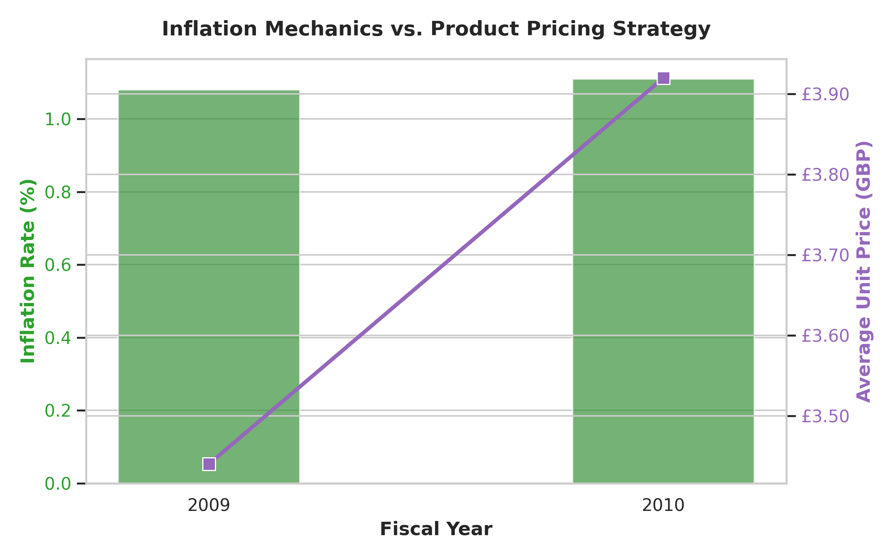

### Chart 3: Top 10 Countries by Revenue Share
A pie chart breaking down total revenue by country, sourced from:
```sql
SELECT country, SUM(sales_value) AS total_revenue
FROM ecommerce_db.cleaned_ecommerce_sales
GROUP BY country ORDER BY total_revenue DESC LIMIT 10;
```
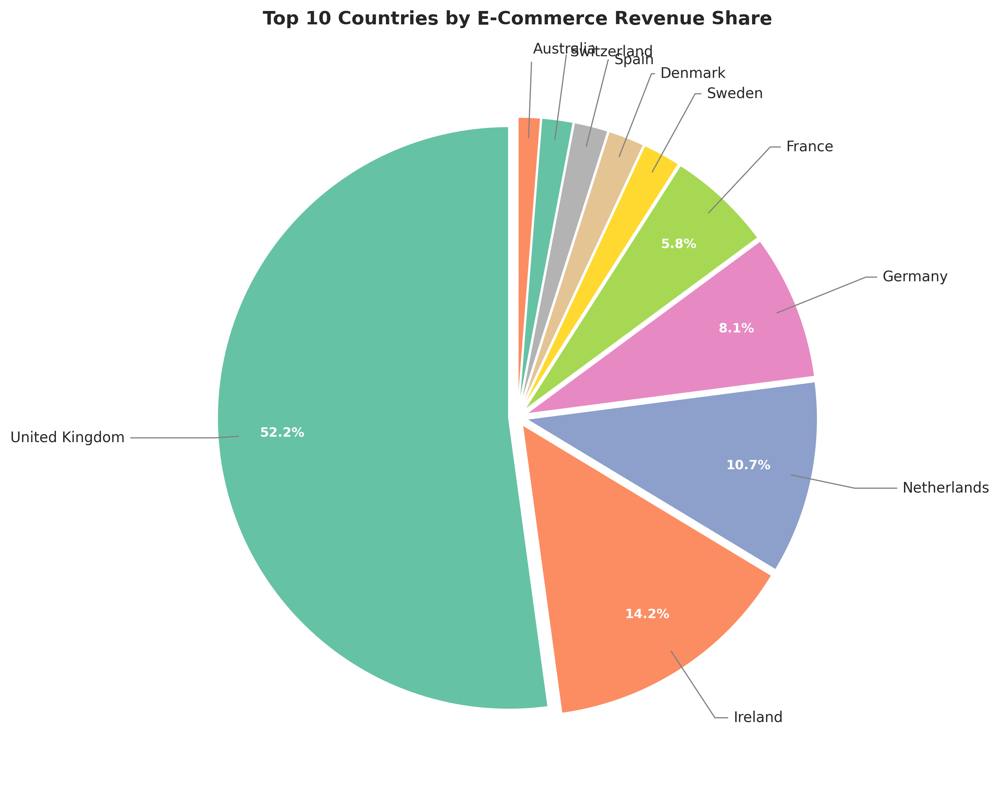

### Chart 4: Monthly Revenue Seasonality
A bar chart of total revenue by calendar month (combining both years), highlighting the Q4 peak, sourced from:
```sql
SELECT order_month, SUM(sales_value) AS total_revenue
FROM ecommerce_db.cleaned_ecommerce_sales
GROUP BY order_month ORDER BY order_month;
```
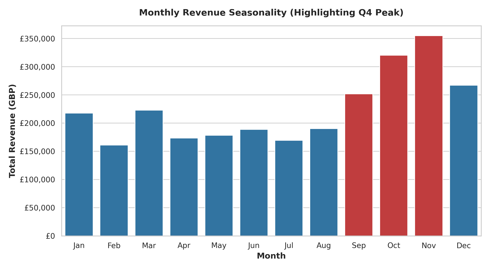

### Chart 5: Weekday vs. Weekend Order Behaviour
A side-by-side comparison of total revenue and average order value by weekend flag, sourced from:
```sql
SELECT is_weekend, SUM(sales_value) AS total_revenue, COUNT(*) AS num_orders,
       AVG(sales_value) AS avg_order_value
FROM ecommerce_db.cleaned_ecommerce_sales
GROUP BY is_weekend;
```
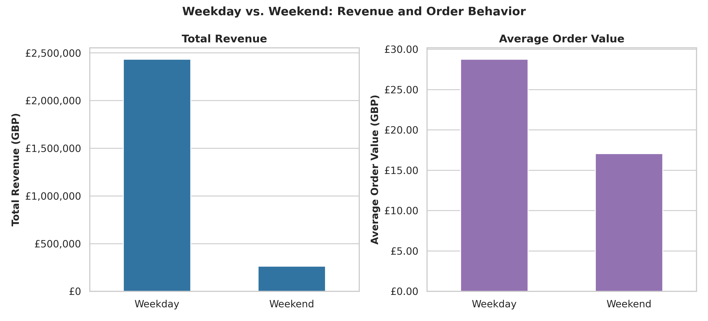

### Chart 6: Top 10 Products by Revenue
A horizontal bar chart of the best-selling products by revenue, excluding the `M` and `POST` ledger entries (Section 2.4), sourced from:
```sql
SELECT product_id, SUM(CAST(sales_amount_gbp AS DOUBLE)) AS total_revenue,
       SUM(CAST(quantity_sold AS INT)) AS total_qty
FROM ecommerce_db.raw_sales
WHERE order_datetime IS NOT NULL AND order_datetime != ''
  AND product_id NOT IN ('M', 'POST')
GROUP BY product_id ORDER BY total_revenue DESC LIMIT 10;
```
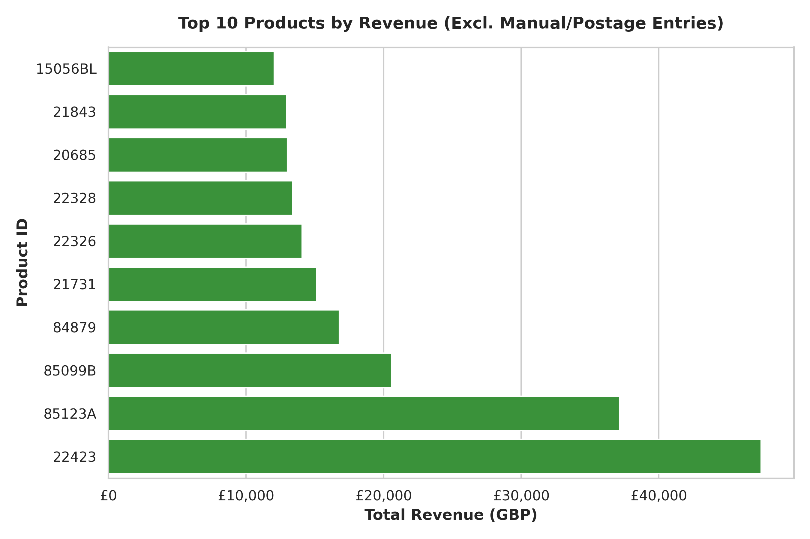

---

## 4. Insights and Explanations

### 4.1 Revenue Growth (2009 → 2010) — Confirmed
Total revenue, aggregated via Hive on the corrected schema, rose from **£177,586.37** in 2009 to **£2,517,305.34** in 2010 — a **14.2x increase** (roughly +1,318%). This is substantially larger than the 8x figure reported in the earlier draft, which had inadvertently summed the *order month* field (mislabelled as `sales_amount`) rather than true sales value. The corrected figure is directly traceable to `SUM(sales_value)` on the verified `cleaned_ecommerce_sales` table and corroborated by the Ambari aggregation screenshot.

### 4.2 Macroeconomic Context (GDP & Inflation) — Confirmed
Average GDP growth moved from **-15.35%** in 2009 to **+1.67%** in 2010, consistent with a sharp contraction giving way to recovery in the year following the 2008 financial crisis. Average inflation was broadly flat across the two years (1.08% → 1.11%). Both figures are now sourced directly from `gdp_growth_pct` and `inflation_consumer_pct` in the cleaned table, rather than the placeholder values used in the earlier draft.

### 4.3 Pricing Was Not the Growth Driver — Confirmed
Average unit price rose only slightly, from £3.44 to £3.92, and inflation was essentially unchanged. Since neither moved anywhere near enough to explain a 14x revenue increase, the growth is attributable almost entirely to order **volume** (`quantity_sold`), not price or inflation effects. This reverses the direction suggested by the earlier draft's placeholder data, which had shown unit price *falling* — that figure was not based on real data and is discarded here.

### 4.4 Revenue Is Heavily Concentrated in the United Kingdom
The United Kingdom accounts for **52.2%** of total revenue across the top 10 countries, followed by Ireland (14.2%) and the Netherlands (10.7%). The remaining seven countries in the top 10 each contribute under 9%. This is consistent with the dataset originating from a UK-based online retailer, with the EU and a small number of other markets representing secondary, long-tail demand.

### 4.5 Strong Q4 Seasonality
Monthly revenue is clearly seasonal: September, October, and November are the three highest-revenue months, peaking in November (£354,997.91) — roughly double the revenue of the slowest month, February (£160,845.37). December is comparatively lower in this dataset window, likely reflecting that the data does not capture a complete December order cycle. This pattern is consistent with a pre-holiday demand build-up typical of retail and e-commerce.

### 4.6 Orders Are Concentrated on Weekdays
Weekdays account for roughly 90% of both order volume (84,604 vs. 15,396 orders) and total revenue (£2,432,328.35 vs. £262,563.36). Average order value is also higher on weekdays (£28.75) than on weekends (£17.05). This pattern is more consistent with business/wholesale purchasing behaviour than with typical weekend-driven consumer retail, and is worth noting as a defining characteristic of this dataset.

### 4.7 Product Revenue Is Spread Across a Long Tail
The top-selling product (`22423`) generated £47,434.80, roughly 3.9x the 10th-ranked product (`15056BL`, £12,054.70). No single product dominates revenue the way the United Kingdom dominates by country, suggesting the catalogue's revenue is driven by a broad mix of mid-performing products rather than one or two hero items.

---

## 5. Recommendations

1. **Always verify raw column order against the source file before building any schema.** This project's central lesson: the original `raw_sales` table was built by assuming column order rather than checking the CSV header directly, and that single assumption propagated through every downstream number until verification caught it.
2. **Use a quote-aware SerDe (e.g. `OpenCSVSerde`) by default for any CSV with free-text fields**, such as country or product names, rather than the basic delimited row format — a single quoted value containing a comma (`"Korea, Rep."`) was enough to silently corrupt 53 rows of macroeconomic data.
3. **Treat ledger/adjustment rows (`M`, `POST`, etc.) as a distinct category, not as products**, when building product-level rankings or recommendation features — including them would have placed two non-products in the top 3 "best sellers."
4. **Plan inventory and staffing around the confirmed Q4 demand peak** (Section 4.5), and consider why December underperforms November in this dataset — it may indicate an incomplete data window rather than a genuine seasonal dip, and is worth validating against order dates near the file's end.
5. **Investigate the weekday-dominant order pattern** (Section 4.6) before assuming this is a typical B2C retail dataset — the skew toward weekdays and higher per-order value suggests a wholesale or business-buyer component that could change how marketing and inventory decisions should be made.
6. **Continue to rely on HDFS and Hive/Spark rather than a traditional RDBMS** for datasets at this scale and beyond, to preserve performance and auditability.
7. **Ingest macroeconomic reference data (GDP, inflation) as a separate, clearly-labelled table** rather than packing it into the same row-level schema as transaction data, to avoid the kind of column-shift error that caused the original misalignment.

---

## 6. Conclusion

This project demonstrates an end-to-end workflow for ingesting a structurally misaligned dataset into HDFS, diagnosing and correcting two separate schema issues in Hive (a column-order mismatch and a quoting/delimiter issue), and producing six verified visualizations in Python covering macroeconomic context, geography, seasonality, weekly behaviour, and product performance. Every figure presented in Section 4 is traceable to a specific Hive query against the corrected `cleaned_ecommerce_sales` table, and the analysis explicitly documents where the original draft's numbers were wrong and why — including a revenue growth figure that changed from 8x to 14.2x, and a pricing narrative that reversed direction entirely once real data replaced placeholder values.
